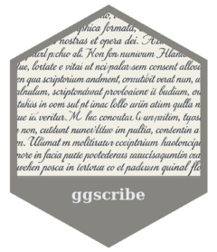

<!-- README.md is generated from README.Rmd. Please edit that file -->
```{r, include = FALSE}
knitr::opts_chunk$set(
  collapse = TRUE,
  comment = "#>",
  fig.path = "man/figures/README-",
  out.width = "100%"
)
```

# ggscribe <a href="https://davidhodge931.github.io/ggscribe/"></a>

<!-- badges: start -->
[](https://CRAN.R-project.org/package=ggscribe)
<!-- badges: end -->

The objective of ggscribe is to provide helpers to annotate 'ggplot2' Visualisation

## Installation

Install from CRAN, or the development version from [GitHub](https://github.com/davidhodge931/ggscribe).
```r
install.packages("ggscribe")
pak::pak("davidhodge931/ggscribe")
```

## Example

```{r, warning=FALSE, message=FALSE}
library(ggplot2)
library(dplyr)
library(stringr)

set_theme(
  ggrefine::theme_grey(
    panel_heights = rep(unit(50, "mm"), 100),
    panel_widths = rep(unit(75, "mm"), 100),
  )
)

ggplot2::mpg |>
  dplyr::mutate(drv = dplyr::case_when(
    drv == "4" ~ "4-wheel",
    drv == "f" ~ "Front",
    drv == "r" ~ "Rear",
  )
  ) |>
  ggplot(aes(x = displ, y = hwy, fill = drv, colour = drv)) +
  geom_point() +
  ggrefine::refine_modern() +
  scale_colour_discrete(palette = blends::multiply(jumble::jumble)) +
  #required for ggscribe
  coord_cartesian(clip = "off") +
  #top labels of low, normal, high
  ggscribe::annotate_axis_text(
    y = c(20, 30, 40),
    element_to = "blank",
    tick_length = rel(-1),
    hjust = 0,
    vjust = -0.5,
  ) +
  ggscribe::annotate_axis_text(
    position = "top",
    x = I(0),
    label = "Low",
    tick_length = rel(0),
    hjust = 0,
  ) +
  ggscribe::annotate_axis_text(
    position = "top",
    x = I(0.5),
    label = "Normal",
    tick_length = rel(0),
    hjust = 0.5,
  ) +
  ggscribe::annotate_axis_text(
    position = "top",
    x = I(1),
    label = "High",
    tick_length = rel(0),
    hjust = 1,
  ) +
  #create space between legend and right labels
  scale_y_continuous(
    position = "right",
    labels = \(x) paste0(
      str_sub(x, 0, 0), #Create space for the word 'Efficient'
      str_flatten(rep(" ", times = str_length("Efficient") + 2))),
    name = NULL,
  ) +
  #inefficient shade and labels
  ggscribe::annotate_panel_shade(ymax = 20, fill = flexoki::flexoki$red["red200"]) +
  ggscribe::annotate_axis_text(
    position = "right",
    y = c(20),
  ) +
  ggscribe::annotate_axis_ticks(
    position = "right",
    y = c(20),
  ) +
  ggscribe::annotate_axis_text(
    position = "right",
    y = (20 + (min(mpg$hwy) - 0.05 * diff(range(mpg$hwy)))) / 2,
    label = "Inefficient",
    element_to = "transparent",
  ) +
  #efficient shade and labels
  ggscribe::annotate_panel_shade(ymin = 30, fill = flexoki::flexoki$blue["blue200"]) +
  ggscribe::annotate_axis_text(
    position = "right",
    y = c(30),
  ) +
  ggscribe::annotate_axis_ticks(
    position = "right",
    y = c(30),
  ) +
  ggscribe::annotate_axis_text(
    position = "right",
    y = (30 + (max(mpg$hwy) + 0.05 * diff(range(mpg$hwy)))) / 2,
    label = "Efficient",
  ) +
  #titles
  labs(
    title = "Highway fuel economy",
    subtitle = "By displacement and drive train\n\n",
    y = NULL,
  )
```

