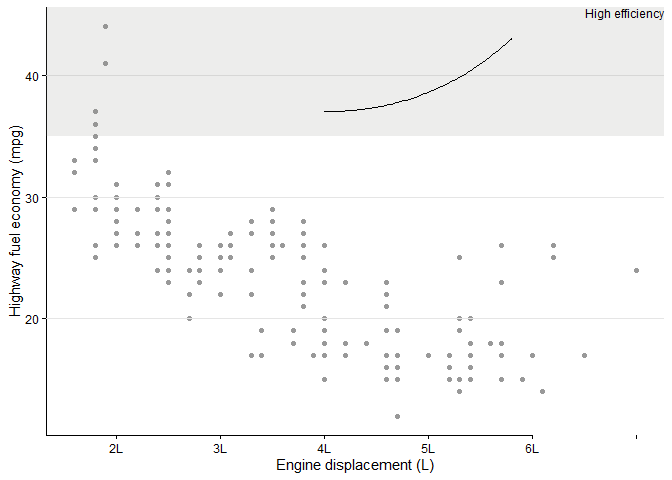

<!-- README.md is generated from README.Rmd. Please edit that file -->

# ggscribe <a href="https://davidhodge931.github.io/ggscribe/"></a>

<!-- badges: start -->

<!-- badges: end -->

ggscribe provides annotation functions for ‘ggplot2’ that inherit style
defaults from the globally set theme. This includes axis lines, axis
ticks, axis text, panel grid lines, and shaded regions.

## Installation

Install from CRAN, or the development version from
[GitHub](https://github.com/davidhodge931/ggscribe).

``` r
install.packages("ggscribe")
pak::pak("davidhodge931/ggscribe")
```

## Example

``` r
library(ggplot2)
library(ggscribe)

set_theme(theme_classic())

ggplot(mpg, aes(displ, hwy)) +
  geom_point(colour = "grey60", size = 1.5) +
  coord_cartesian(clip = "off") +
  # Axis lines — partial bottom axis up to displ = 6, full left axis
  annotate_axis_line(position = "bottom", xmax = 6, element_to = "blank") +
  annotate_axis_line(position = "left", element_to = "blank") +
  # Axis ticks
  annotate_axis_ticks(position = "bottom", x = c(2, 3, 4, 5, 6)) +
  annotate_axis_ticks(position = "left", y = c(20, 30, 40)) +
  # Axis text — native text blanked so custom labels are the sole source
  annotate_axis_text(position = "bottom", x = c(2, 3, 4, 5, 6),
                     label = c("2L", "3L", "4L", "5L", "6L"),
                     element_to = "transparent") +
  annotate_axis_text(position = "left", y = c(20, 30, 40),
                     element_to = "transparent") +
  # Panel grid — horizontal lines at y breaks only
  annotate_panel_grid(y = c(20, 30, 40), element_to = "transparent") +
  # Panel shade — highlight the high efficiency region
  annotate_panel_shade(ymin = 35, ymax = Inf, alpha = 0.15) +
  # Label the shaded region — placed above and to the right of the panel
  annotate_axis_text(x = I(1), y = I(1), label = "High efficiency",
                     hjust = 1, vjust = 1) +
  # Curve from label down into the shaded region, avoiding the data
  annotate_axis_line(x = 5.8, y = 43, xend = 4, yend = 37,
                     curvature = -0.2) +
  labs(
    x = "Engine displacement (L)",
    y = "Highway fuel economy (mpg)"
  )
#> Warning: The set theme does not define a `panel.grid` colour. Defaulting to
#> grey.
#> Warning: The set theme does not define a `panel.grid` linewidth. Defaulting to
#> `0.5`.
```



## Other packages

This package is part of the `ggblanketverse`.

<table>

<tr>

<td align="center" valign="top">

<a href="https://davidhodge931.github.io/ggblanket">

</a>
</td>

<td align="center" valign="top">

<a href="https://davidhodge931.github.io/ggrefine">

</a>
</td>

<td align="center" valign="top">

<a href="https://davidhodge931.github.io/ggwidth">

</a>
</td>

</tr>

<tr>

<td align="center" valign="top">

<a href="https://davidhodge931.github.io/ggscribe">

</a>
</td>

<td align="center" valign="top">

<a href="https://davidhodge931.github.io/blendle">

</a>
</td>

<td align="center" valign="top">

<a href="https://davidhodge931.github.io/jumble">

</a>
</td>

</tr>

</table>
