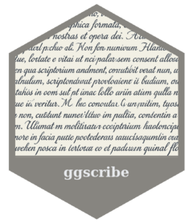

<!-- README.md is generated from README.Rmd. Please edit that file -->

# ggscribe <a href="https://davidhodge931.github.io/ggscribe/"></a>

<!-- badges: start -->

[](https://CRAN.R-project.org/package=ggscribe)
<!-- badges: end -->

The objective of ggscribe is to provide annotation helper functions for
publication-quality ‘ggplot2’ visualisation.

Note:

- Use the secondary axis, subtitle, or axis titles to adjust space.
- `axis_*` functions placed outside the panel require `clip = "off"` in
  the coord space.

## Installation

Install from CRAN, or the development version from
[GitHub](https://github.com/davidhodge931/ggscribe).

``` r
install.packages("ggscribe")
pak::pak("davidhodge931/ggscribe")
```

## Other packages

This package is part of a group of related packages built to extend
[ggplot2](https://ggplot2.tidyverse.org).

<table>

<tr>

<td align="center">

<a href="https://davidhodge931.github.io/ggblanket/"></a>
</td>

<td align="center">

<a href="https://davidhodge931.github.io/ggrefine/"></a>
</td>

<td align="center">

<a href="https://davidhodge931.github.io/ggscribe/"></a>
</td>

<td align="center">

<a href="https://davidhodge931.github.io/ggwidth/"></a>
</td>

<td align="center">

<a href="https://davidhodge931.github.io/blends/"></a>
</td>

<td align="center">

<a href="https://davidhodge931.github.io/jumble/"></a>
</td>

</tr>

</table>
