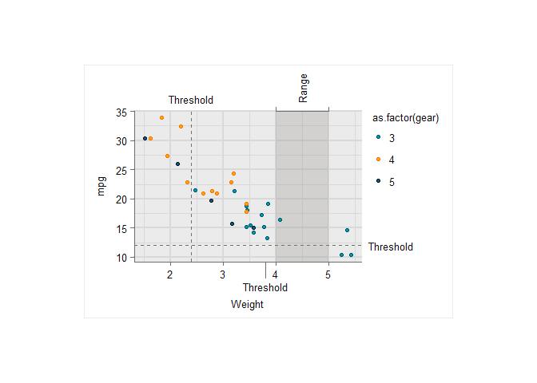
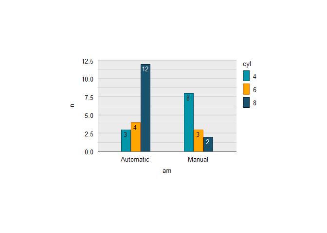

# ggscribe

The objective of ggscribe is to provide annotation helper functions for
publication-quality ‘ggplot2’ visualisation.

Note:

- Use the secondary axis, or subtitle, caption, axis titles or labels to
  adjust space in the plot.
- `axis_*` functions generally require a globally set theme with panel
  dimensions and `coord_cartesian(clip = "off")`.
- `panel_shade` should be before geoms.

## Installation

Install from CRAN, or the development version from
[GitHub](https://github.com/davidhodge931/ggscribe).

``` r

install.packages("ggscribe")
pak::pak("davidhodge931/ggscribe")
```

## Example

ggscribe provides various axis and panel annotation helper functions.

``` r

library(ggplot2)
library(dplyr)

set_theme(
  ggrefine::theme_grey(
    panel_heights = rep(unit(50, "mm"), 100),
    panel_widths = rep(unit(75, "mm"), 100),
  )
)

mtcars |>
  ggplot(aes(x = wt, y = mpg, colour = as.factor(gear), fill = as.factor(gear))) +
  scale_colour_discrete(palette = blends::multiply(get_theme()$palette.colour.discrete)) +
  #clip = "off" is required for axis_text, axis_ticks and axis_bracket
  coord_cartesian(clip = "off") +
  #reference lines and shade
  ggscribe::reference_line(xintercept = 2.4) +
  ggscribe::reference_line(yintercept = 12)  +
  ggscribe::panel_shade(
    xmin = 4,
    xmax = 5,
  ) +
  #top axis
  scale_x_continuous(
    sec.axis = ggscribe::sec_axis_text(
      breaks = c(mean(c(4, 5))),
      labels = c("Range"),
      guide = ggscribe::guide_sec_axis_text(
        angle = 90,
      )
    )
  ) +
  ggscribe::axis_bracket(
    position = "top",
    breaks = c(4, 5),
  ) +
  ggscribe::axis_text(
    position = "top",
    breaks = c(2.4),
    labels = c("Threshold"),
  ) +
  #right axis
  ggscribe::axis_text(
    position = "right",
    breaks = 12,
    labels = "Threshold",
  ) +
  #bottom axis
  ggscribe::axis_ticks(
    position = "bottom",
    breaks = 3.8,
    length = rel(5),
  ) +
  ggscribe::axis_text(
    position = "bottom",
    breaks = 3.8,
    labels = "Threshold",
    length = rel(5),
  ) +
  labs(x = "\nWeight") +
  #geom
  geom_point() +
  #annotations fit plot
  theme(plot.background = element_rect(colour = "grey92"))
```



And a function to ensure text is easily coloured for contrast on a fill
aesthetic.

``` r

ggwidth::set_equiwidth(equiwidth = 1.75)

mtcars |>
  count(cyl, am) |>
  mutate(
    am = if_else(am == 0, "Automatic", "Manual"),
    cyl = as.factor(cyl)
  ) |>
  ggplot(aes(x = am, y = n, colour = cyl, fill = cyl, label = n)) +
  geom_col(
    position = position_dodge2(preserve = "single", padding = 0.05),
    width = ggwidth::get_width(n = 2, n_dodge = 3),
  ) +
  scale_fill_discrete(palette = jumble::jumble) +
  scale_colour_discrete(palette = blends::multiply(jumble::jumble)) +
  geom_text(
    mapping = ggscribe::aes_contrast(), # or aes(!!!ggscribe::aes_contrast()),
    position = position_dodge2(
      width = ggwidth::get_width(n = 2, n_dodge = 3),
      padding = 0.05,
      preserve = "single"),
    vjust = 1.33,
    show.legend = FALSE,
  ) +
  scale_y_continuous(expand = expansion(c(0, 0.05))) +
  ggrefine::modern(x_type = "discrete")
```



## Other packages

This package is part of a group of related packages built to extend
[ggplot2](https://ggplot2.tidyverse.org).

|  |  |  |  |  |  |
|:--:|:--:|:--:|:--:|:--:|:--:|
| [](https://davidhodge931.github.io/ggblanket/) | [](https://davidhodge931.github.io/ggrefine/) | [](https://davidhodge931.github.io/ggscribe/) | [](https://davidhodge931.github.io/ggwidth/) | [](https://davidhodge931.github.io/blends/) | [](https://davidhodge931.github.io/jumble/) |
